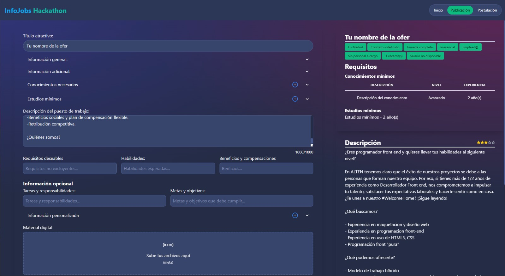
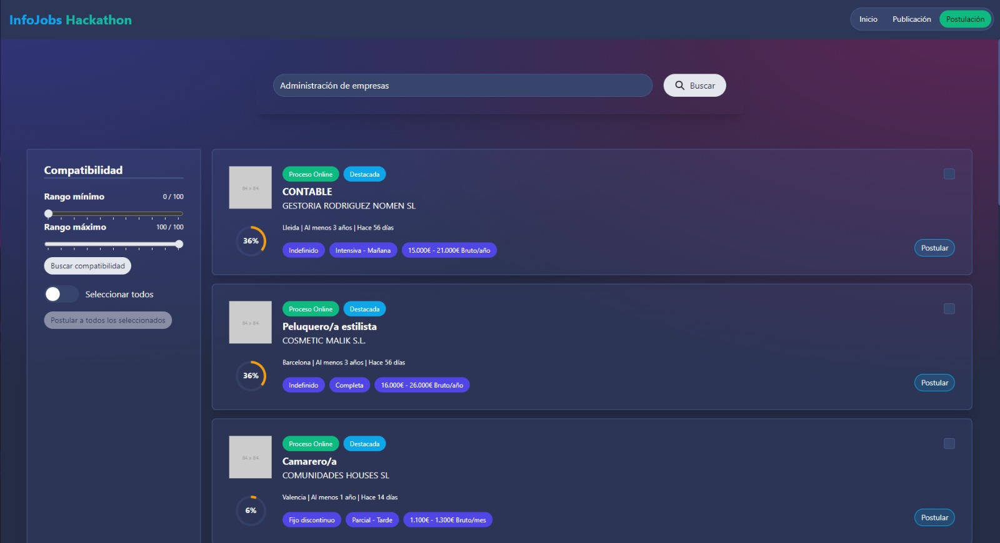

#  JobEase

## Simplifica y Mejora tu Experiencia de Búsqueda y Postulación de Empleo. Prueba la nueva app aquí ➡️ [JobEase](https://hackathon-info-jobs.vercel.app)
***

## 💫 Potenciado por InfoJobs
***
InfoJobs es una plataforma de empleo líder en España, con más de 3 millones de usuarios registrados y 10 millones de visitas mensuales. Cada día, miles de personas buscan empleo en InfoJobs, y cientos de empresas publican sus ofertas de trabajo. Sin embargo, el proceso de búsqueda y postulación de empleo puede ser tedioso y poco eficiente. Por un lado, las empresas tienen que escribir largos textos para describir sus ofertas de trabajo, lo que puede ser confuso y poco atractivo para los postulantes. Por otro lado, los postulantes tienen que revisar cada descripción de empleo en detalle para saber si cumplen con los requisitos y habilidades necesarios. Esto puede ser un proceso largo y agotador, especialmente cuando se postulan a múltiples empleos.

## 📌 Tabla de Contenidos
***
- [ JobEase](#-jobease)
  - [Simplifica y Mejora tu Experiencia de Búsqueda y Postulación de Empleo. Prueba la nueva app aquí ➡️ JobEase](#simplifica-y-mejora-tu-experiencia-de-búsqueda-y-postulación-de-empleo-prueba-la-nueva-app-aquí-️-jobease)
  - [💫 Potenciado por InfoJobs](#-potenciado-por-infojobs)
  - [📌 Tabla de Contenidos](#-tabla-de-contenidos)
  - [💣 Publicación simplificada de empleos](#-publicación-simplificada-de-empleos)
  - [❤️ Mejora en la postulación](#️-mejora-en-la-postulación)
  - [🚀 Tecnologías](#-tecnologías)
  - [📌 Instalación](#-instalación)
  - [📝 Licencia](#-licencia)
  - [🤝 Contribuciones](#-contribuciones)
  - [🔥 Conclusiones](#-conclusiones)

## 💣 Publicación simplificada de empleos
***

Nuestra solución simplifica el proceso de publicación de empleos en InfoJobs. Ahora, la persona encargada no tiene que
escribir largos textos, sino que se guía a través de un formulario intuitivo. Además, hemos incorporado una tabla con
los requisitos necesarios clasificados por niveles, lo que nos permite ahorrar espacio y hacer la publicación más
concisa.

Además, hemos incorporado inteligencia artificial para ayudar a mejorar las descripciones de los empleos. Ofrecemos
consejos y sugerencias para optimizar la redacción, brindando una calificación del 0 al 5 estrellas para evaluar la
calidad de la descripción. Esto permite a los empleadores obtener una descripción más atractiva y efectiva, lo que a
su vez aumenta las posibilidades de atraer a candidatos altamente calificados.

También hemos agregado la opción de subir archivos de video e imágenes, lo que mejora la interacción con los
postulantes. Ahora pueden ver cómo es la oficina donde trabajarían, conocer más sobre el puesto de trabajo o incluso
familiarizarse con el equipo con el que colaborarían. Esta función enriquece la experiencia del postulante y les brinda
una visión más completa del empleo.



- Publicación simplificada de empleos con formulario intuitivo.
- Asistencia de inteligencia artificial para mejorar las descripciones de los empleos.
- Tabla de requisitos clasificados por niveles para hacer las publicaciones más concisas.
- Calificación de estrellas del 0 al 5 para evaluar la calidad de las descripciones de empleo.
- Posibilidad de subir archivos de video e imágenes para enriquecer la experiencia del postulante.
- Cuenta con un previsualizador para saber como quedaría la postulación.

## ❤️ Mejora en la postulación
***

Nuestra segunda solución se enfoca en mejorar el proceso de postulación en InfoJobs. Hemos añadido un nuevo filtro de
compatibilidad con el empleo, donde los candidatos pueden evaluar del 0 al 100% qué tan compatible es su currículum con
el puesto de trabajo. Esto les brinda una mejor comprensión de si cumplen con los requisitos y habilidades necesarios.

Con esta funcionalidad, los postulantes pueden postularse a múltiples puestos de trabajo seleccionados con un solo
botón, sin necesidad de revisar en detalle cada descripción de empleo. Al contar con el filtro de compatibilidad,
tienen más confianza de que encajan en el perfil buscado, ahorrando tiempo y esfuerzo en su búsqueda laboral.



- Filtro de compatibilidad con el empleo para una mejor selección de postulantes.
- Postular a múltiples empleos seleccionados con un solo botón.
- Ahorras mucho más tiempo.

## 🚀 Tecnologías
***
- [InfoJobs](https://www.infojobs.net)
- [OpenAI](https://openai.com)
- [Skeleton](https://www.skeleton.dev)
- [Tailwind CSS](https://tailwindcss.com)
- [Svelte](https://svelte.dev)
- [Vercel](https://vercel.com)
- [Vite](https://vitejs.dev)

## 📌 Instalación
***
1. Clona el repositorio
```bash
git clone
```
2. Instala las dependencias
```bash
npm install
```
3. Ejecuta el proyecto
```bash
npm run dev
```
4. Abre el navegador en [localhost:5173](http://localhost:5173)
5. Disfruta 🎉
6. Si quieres construir el proyecto para producción, ejecuta
```bash
npm run build
```

## 📝 Licencia
***
Este proyecto está bajo la Licencia MIT - mira el archivo [LICENSE.md](LICENSE.md) para más detalles.

## 🤝 Contribuciones
***
Si quieres contribuir a este proyecto, puedes hacerlo enviando un [pull request]()

## 🔥 Conclusiones
***
En conclusión, el proyecto JobEase ha sido una solución innovadora para simplificar y mejorar la experiencia de búsqueda y postulación de empleo en InfoJobs. Nuestra plataforma ha abordado dos aspectos clave: la publicación simplificada de empleos y la mejora en el proceso de postulación.